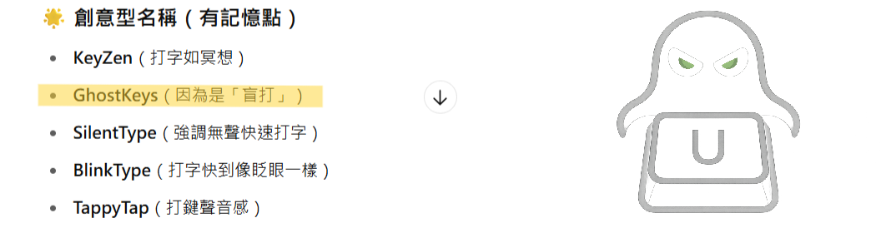
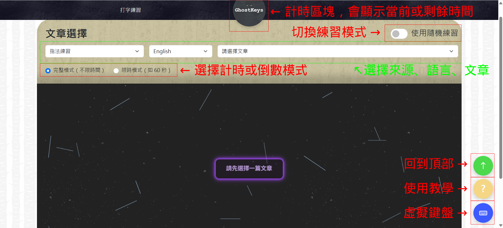
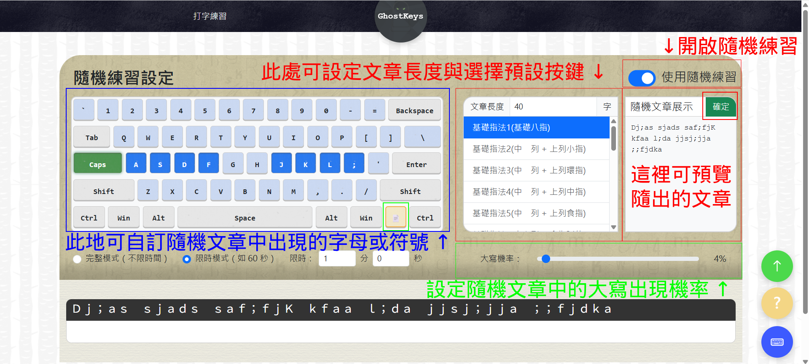
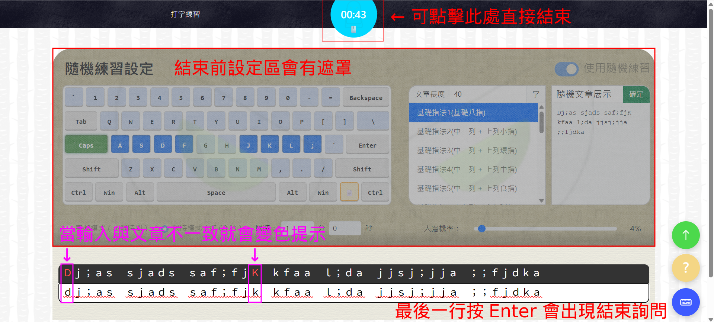
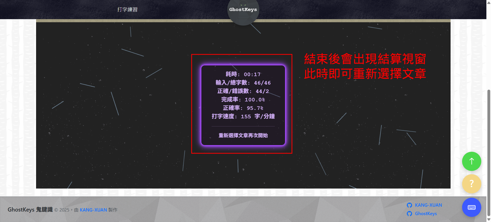

# GhostKeys 鬼鍵識 © 2025

練習盲打，提升打字速度與準確度的趣味工具。

---

## 專案簡介

GhostKeys 是一款用 Vue 3 + Pinia 開發的打字練習應用，結合即時錯誤提示、計時功能與多語言切換，讓你在愉快的遊戲體驗中提升盲打技能。

因為在線上找不到符合心意的練習網站給家人，找到的都有美中不足的地方，因此才決定自行製作符合心意的練習網站，這就是該專題的開發動機。




---

## Demo 體驗連結

🔗 https://kang-xuan.github.io/GhostKeys/ <br>
- 線上版因瀏覽器限制無法讀取本地檔案，目前僅支援「隨機練習功能」。  
- 若欲體驗完整功能，請下載專案至本地執行。  

---

## 安裝與執行


*▲ 下載到本地全過程演示*

<details>
<summary><strong>🔧 展開查看桌面版clone安裝與啟動流程</strong></summary>

1. 取得專案碼
```
git clone https://github.com/KANG-XUAN/GhostKeys.git
```

2. 安裝依賴(僅需第一次)
  - 雙擊 `自動_install.bat` 即可自動安裝所需依賴

3. 啟動開發伺服器
  - 雙擊 `自動_啟動.bat` 自動啟動前後端伺服器視窗
  - ⚠️ 如果 `自動_啟動` 無法正常出現前後端cmd，那麼請分別使用 `自動_啟動前端.bat` 、 `自動_啟動後端.bat` 即可分開啟動

4. 在瀏覽器開啟
  - 找到前端啟動視窗（cmd）中顯示的網址，複製貼到瀏覽器開啟
</details>

---

## 功能特色

- **多語言切換**：支援英文與中文練習自由切換  
- **即時錯字標示**：輸入錯誤文字會以紅色顯示  
- **計時器**：開始打字即計時，結束可查看用時  
- **多段落練習**：依文章分行輸入，模擬真實盲打情境  
- **錯誤與輸入字數統計**：結算區顯示輸入字數、錯誤數與正確字數  

---

## 使用說明

- 選擇文章後，開始輸入，系統會即時偵測錯誤並計時  
- 完成後，結算區會顯示你的錯誤數與輸入統計  
- 點擊中央圓形計時器可以停止計時

  
*▲ 圖1：進入網站畫面介紹*
  
*▲ 圖2：隨機練習模式說明*
  
*▲ 圖3：練習途中畫面指引*

*▲ 圖4：結算畫面效果展現*

---

## 技術棧

### 🔹 前端
- Vue 3 + Composition API  
- Pinia 狀態管理  
- CSS3  

### 🔹 後端
- Node.js  
- Express.js（處理 API 路由）  
- fs / path（檔案與目錄操作）  

### 🔹 其他
- 自動批次腳本（Windows `.bat`）

---

## API 簡介（開發用途）

| 路由 | 方法 | 說明 |
|------|------|------|
| `/api/templates/list` | GET | 取得所有練習文章檔案清單 |
| `/api/templates/file?path=xxx&lang=xxx&name=xxx` | GET | 取得單一文章內容（需帶 query：`path`, `lang`, `name`） |

---

## 專案結構
📁 查看完整 [檔案結構](./docs/檔案結構.txt)
<details>
<summary><strong>展開查看精簡版檔案結構</strong></summary>

```
GhostKeys/
├── backend/ # 後端（Node.js + Express）
│   └── routes/
│       └── templates.js # 提供 /api/templates 路由
│
├── frontend/ # 前端（Vue 3 + Pinia）
│   └── src/
│       ├── components/ # Vue 組件（含 info、typing、common 等）
│       ├── stores/ # Pinia 狀態管理模組
│       └── views/ # 首頁元件等
│
├── public/
│   └── textTemplates/ # 練習文本（支援 ch/en）
│       ├── main/
│       └── models/
│
├── 自動_Install.bat # 一鍵安裝依賴
├── 自動_啟動.bat # 一鍵啟動前後端
├── LICENSE
└── README.md
```

</details>

---

## 作者

[KANG-XUAN](https://github.com/KANG-XUAN)

---
## 授權條款

本專案授權採用 **MIT License**，詳見 [LICENSE](./LICENSE) 檔案。

### 外部素材授權

- 背景圖樣由 [TransparentTextures.com](https://www.transparenttextures.com) 提供  
  授權方式為 [Creative Commons BY 3.0](https://creativecommons.org/licenses/by/3.0/)，僅用於美術展示用途。
